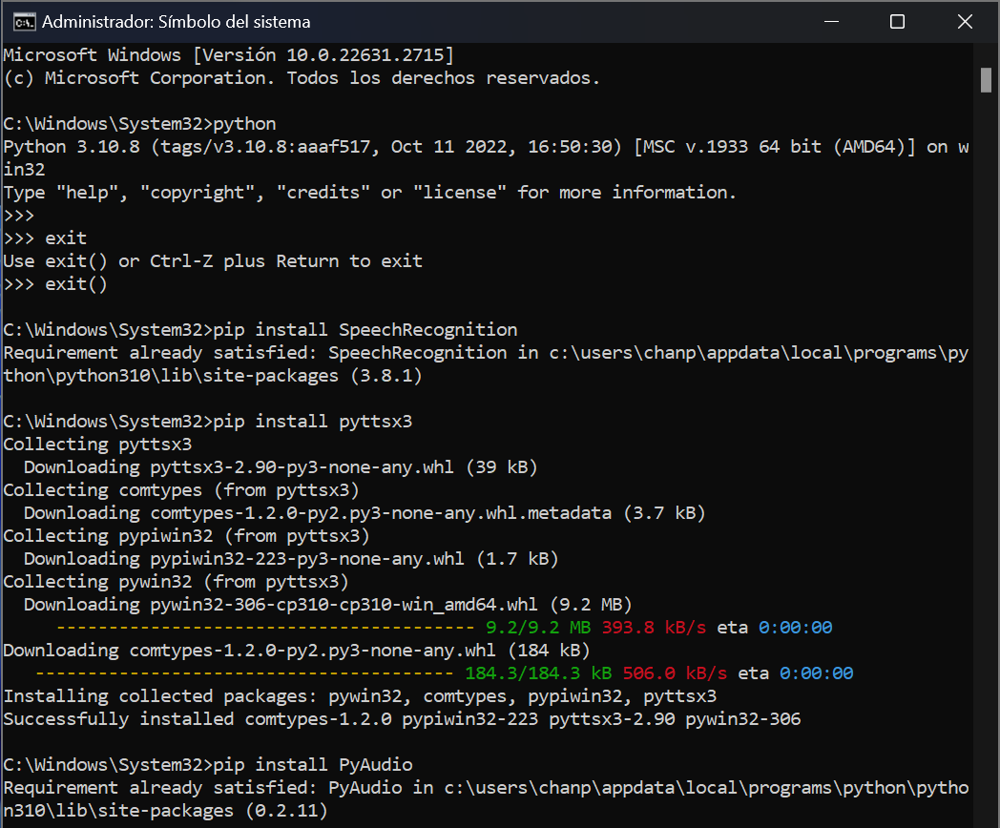
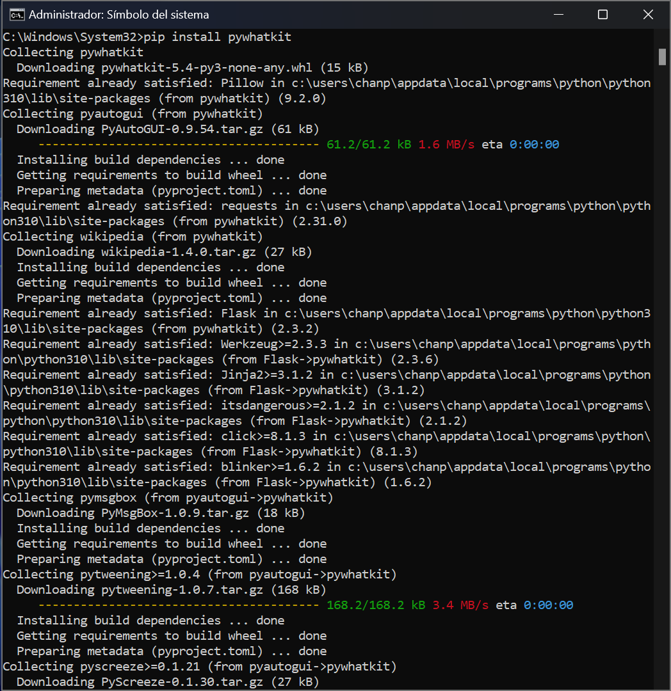

# asistente-Juanita-0.1

Es necesario actualizar las dependencias y descargar las librerias de python

### 1-Verificar la Versión de Python
Abrir un cmd o Simbolo del Sistema y ejecutarlo como administrador.
Escribir la palabra Python y dar ENTER para comprobar de que Python este instalado.
Si Python esta instalado verificar que version y si es de 32 ó de 64 bits.
Si Python no esta instalado ejecutar el comando:

```
pip install Python
```

### 2-Descargar SpeechRecognition
Ejecutar el comando:

```
pip install SpeechRecognition
```

### 3-Descargar pyttsx3
Ejecutar el comando:

```
pip install pyttsx3
```

### IMPORTANTE
Para descargar la siguiente libreria necesitas saber muy bien cual es tu version de Python
e identificar el tipo de sistema y su arquitectura ya que este puede cambiar dependiendo el
ordenador.

Dirigete a la siguiente liga una vez hayas identificado lo anterior.
[Py-Audio](https://www.lfd.uci.edu/~gohlke/pythonlibs/#pyaudio)

Y descarga el archivo que este de acuerdo a la version y arquitectura de Python.

En mi caso tengo la version 3.10.8 con arquitectura de 64 bits AMD64,
por lo tanto el archivo a descargar se llamaría:

```
PyAudio-0.2.11-cp310-cp310-win_amd64.whl
```

cp310 es la palabra clave para identificar que version descargar ya que mi version de Python es la 3.10

Al descargarlo abre el archivo en una terminal, si no sabes utilizar cmd solo dirigete a archivos,
abre el directorio donde guardaste la descarga, en mi caso es Descargas, das click derecho sobre el archivo
y posteriormente a abrir en una nueva terminal 

### 4-Instala PyAudio con el siguiente comando:

```
pip install "El-nombre-de-la-descarga.whl"
pip install PyAudio-0.2.11-cp310-cp310-win_amd64.whl
```


### 5-Descargar pywhatkit con el siguiente comando:

```
pip install pywhatkit
```

Y eso sería todo; actualmente este asistente sigue en desarrollo y este repositorio
es parte de una pruba de dicho proyecto.
Se estara actualizando el repositorio constantemente actualizando librerias y el código en general.




